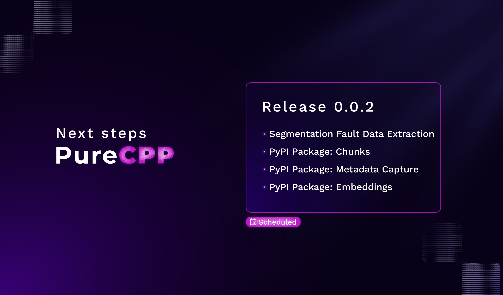

# PureCPP framework
**PureCPP** is the C++ backend for architectural code that powers the RAG system.
PureCPP is a GPU-accelerated RAG (Retrieval-Augmented Generation) framework, written in modern C++ with Python bindings. Designed for maximum performance and scalability, it integrates vector search, ONNX models, and CUDA acceleration into a seamless, production-ready core.

This repository provides detailed guidance on how to set up the environment, configure dependencies with Conan, and compile the project using CMake — going beyond a simple build, it shows how to prepare a robust development pipeline.
---

## 📖 Documentation
For detailed installation and setup instructions, please refer to our official documentation:

🔗 [PureCPP Documentation](https://docs.puredocs.org/setup)

---

## 🚀 Contributing to PureCPP

We welcome contributions to **PureCPP**! If you would like to contribute, please read our contribution guide before opening an issue or submitting a pull request:

👉 [Contribution Guide](/community/CONTRIBUTING.md)

---

## 📌 Minimum Requirements

Ensure you have the following dependencies installed before building PureCPP:

- **GCC/G++** 13.1
- **CMake** 3.22
- **Conan** 2
- **Rust**

## 📚 Table of Contents

- [Introduction](#purecpp-framework)
- [Documentation](#-documentation)
- [Contributing](#-contributing-to-purecpp)
- [Minimum Requirements](#-minimum-requirements)
- [Environment Setup](#environment-setup-ubuntu--debian-for-c-and-python-development)
- [Using Pre-trained Models](#7-use-pre-trained-models)
- [Build Instructions](#how-to-build)
  - [Compile All Modules](#compile-all-at-once)
  - [Compile Individually](#compile-one-at-time)
- [Next Steps](#-next-steps)

---
# Environment Setup (Ubuntu / Debian) for C++ and Python Development

## 1. Clone the Repository

```bash
git clone --recursive https://github.com/pureai-ecosystem/purecpp.git
cd purecpp
````

> **Note:**  
> If you forgot to use `--recursive` when cloning the repository,  
> make sure to run:
>
> ```bash
> git submodule update --init --recursive
> ```
>
> This will initialize and update all required Git submodules.

## 2. Installing dependencies

Run the following commands:

```bash
sudo apt update && \
sudo apt upgrade -y && \
sudo apt install -y  build-essential nano wget \
    curl ninja-build cmake libopenblas-dev \
    libgflags-dev python3-dev libprotobuf-dev \
    protobuf-compiler
````

---

## 3. Install python essential packages

```bash
pip install build conan cmake requests pybind11
````

---

## 4. Execute the FAISS installation script

```bash
chmod +X installers/install_faiss_ubuntu.sh
./installers/install_faiss_ubuntu.sh
````

---

## 5. Install Rust via rustup

### Run rustup installer non-interactively (-y). This places cargo and rustc in /root/.cargo.
```bash
curl --proto '=https' --tlsv1.2 -sSf https://sh.rustup.rs | sh -s -- -y
````

### Activate Rust Environment:
```bash
source ~/.cargo/env
````

---

## 6. Setting the Default Conan Profile

To ensure Conan has a working default configuration, run:

```bash
conan profile detect --force
````

### What does this command do?

* It **creates the folder**:

  ```
  ~/.conan2/
  ```

* It **generates the default profile file**:

  ```
  ~/.conan2/profiles/default
  ```

* It **automatically detects and writes** your system’s configuration, including:

  * Operating system (`os`)
  * Architecture (`arch`)
  * Compiler (`compiler`, `compiler.version`, `compiler.cppstd`, `compiler.libcxx`)
  * Build type (`build_type`)

This is necessary for Conan to correctly resolve and build C++ dependencies on your system.

### 🔍 Locating the profile file

If you want to verify the path of the `default` profile, run:

```bash
find ~ -type d -wholename "*/.conan2/profiles"
```

> **Note:** By default, this will be under:
>
> ```
> /home/<user>/.conan2/profiles/
> ```

### Editing the profile

Once you’ve located the `default` profile, you shall edit it to explicitly set the following configuration:

```bash 
cat << EOF > ~/.conan2/profiles/default 
[settings]
arch=x86_64
build_type=Release
compiler=gcc
compiler.cppstd=17
compiler.libcxx=libstdc++11
compiler.version=11
os=Linux
EOF
````

---

## 7. Use pre-trained models

### 🛠️ Hugging Face to **ONNX** Converter 

**`models_to_onnx.py`**

This is a unified Python script to convert Hugging Face models into the ONNX format for optimized inference.

The script handles two main use cases:
1. **Feature extraction models** (e.g., `sentence-transformers`).
2. **Token classification models** (e.g., Named Entity Recognition - NER).

It automatically creates a `models` directory (in the parent folder of the script) to store the exported ONNX models and related assets.

### Requirements

Before running the script, make sure you have the following Python packages installed:

```bash
pip install torch transformers onnx onnxruntime optimum
```

### 🔧 How to Use

| Argument          | Description                                           |
| ----------------- | ----------------------------------------------------- |
| `-m` / `--model`  | Hugging Face model name (e.g., `dslim/bert-base-NER`) |
| `-o` / `--output` | Output folder name                                    |
| `--mode`          | `feature` or `token` (default: `token`)               |
| `--base_dir`      | Base save directory (default: `./models`)             |

---

## 🚀 Examples

```bash
python model_to_onnx.py -m="dbmdz/bert-large-cased-finetuned-conll03-english" -o="bert-large-cased-finetuned-conll03-english"
```

```bash
python model_to_onnx.py -m="sentence-transformers/all-MiniLM-L6-v2" -o="sentence-transformers/all-MiniLM-L6-v2"
```

## Output

```
/models/ 
  ├── sentence-transformers/all-MiniLM-L6-v2/ 
  │    ├── model.onnx (via optimum)
  │    └── tokenizer/ 
  └── dslim/bert-base-NER/  
       ├── model.onnx  
       ├── label_map.json  
       └── tokenizer/ 
```

---

# How to build 

This is a development version with an automatic pipline build system. Optimizing the process, making it easy to compile and test all five modules automatically in this development version.

To compile and build, just use the provided scripts — no manual setup needed.

Each module (CMAKE_LIBS, CMAKE_META, CMAKE_EMBED, CMAKE_EXTRACT, CMAKE_CHUNKS_CLEAN) has its own o.sh script, which:

- Cleans the build/ folder

- Installs Conan dependencies if missing

- Compiles the code

- Sends the .so output to the central Sandbox/ directory

## Compile all at once
```
./all_cmake.sh
```

## Compile one at time
```
./module_cmake.sh
```

The resulting libraries will be placed inside `Sandbox` dir:

```
Sandbox/
├── purecpp_chunks_clean.cpython-312-x86_64-linux-gnu.so
└── ...
```


## 📌 Next Steps


Stay tuned for updates! 🚀
